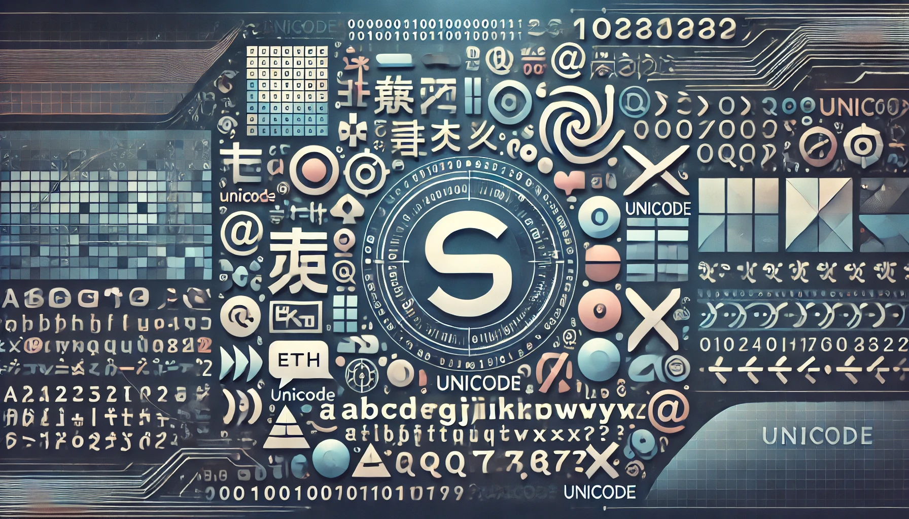

import Header from "../../src/components/Body/Article/Header.tsx";

# {frontmatter.title}

<Header frontmatter={frontmatter} />

At the core of all computing lies electronic digital signal processing. Everything displayed on a computer screen—whether words, text, or numbers—is ultimately an interpretation of electrical signals, processed as bytes. These byte values are then assigned specific meanings using standardized mappings, which allow them to be represented as characters or symbols in a human-readable format.

One of the most well-known character encoding standards is ASCII (American Standard Code for Information Interchange). ASCII assigns unique numerical values to characters, including letters, digits, punctuation marks, and control symbols. These values can be represented in different numeral systems such as decimal, octal, or hexadecimal.

By following such encoding schemes, computers translate raw binary data into meaningful text and symbols, making digital communication and interaction seamless for users.

A character set is a collection of character codes mapped to their corresponding characters or symbolic representations. Various character sets have been created to support different languages and symbols. For example, the BIG5 character set is used for Chinese characters, while ISO-8859-1 is commonly used for English alphabets. A character set is also referred to as a charset.

Many different charsets exist to represent symbols from different languages, locations, and specialized fields, such as mathematical symbols (e.g., the π symbol).

For a programmer working on an application, correctly identifying the appropriate character set is crucial to ensuring that symbols and text are accurately represented. This becomes especially challenging in applications that need to support multiple languages and cultures, such as web applications requiring localization and internationalization.

To address this issue, computer scientists sought a universal character set capable of representing all possible symbols without requiring developers to switch between multiple charsets. This led to the creation of **Unicode**.

## Unicode: A Universal Character Set

Unicode was developed by Joe Becker (Xerox), Lee Collins, and Mark Davis (Apple) to provide a Unique, Universal, and Uniform encoding system for characters. Unicode defines 17 “code planes,” covering code points from 0 to 16.

-   The first plane (Plane 0) is called the Basic Multilingual Plane (BMP) and contains the most commonly used characters.
-   The remaining planes (Planes 1-16) are known as Supplementary Planes or Astral Planes and accommodate additional characters, including historical scripts, rare symbols, and emoji.
-   Planes 3-13 remain unassigned, meaning no character codes have been allocated to them yet.

Since the BMP includes most of the characters needed for internationalization and localization, it is sufficient for the majority of web applications.

## Unicode: Terminologies

The following are some important Unicode concepts and terminologies that one should understand.

### Code Point

A code point (or code position) is a code value used to represent a particular symbol in the Unicode character set. The hexadecimal range of code points is **0x0** to **0x10FFFF**. Code points are referred to using **“U+”** followed by a hexadecimal number. Basic Multilingual Plane (BMP) code points are represented using a four-digit hexadecimal notation (e.g., **U+0058** for the character **LATIN CAPITAL LETTER X**). Code points outside the BMP range are represented using five or six hexadecimal digits.

### Code Unit

A code unit is the number of bits an encoding format uses to represent a Unicode symbol.

-   **UTF-8** uses **8-bit** code units.
-   **UTF-16** uses **16-bit** code units.
-   **UTF-32** uses **32-bit** code units.

A code point can be represented using one or more code units. For example, in the higher supplementary planes, UTF-8 may use four 8-bit code units, while UTF-16 would require two 16-bit code units.

### Characters and graphemes

Characters and graphemes are related but distinct concepts.

-   **Characters** are the digital representation of the atomic units of written language.
-   **Graphemes** are the smallest units of written language as perceived by users.

Programmers typically work with characters, while users perceive graphemes. Sometimes, multiple characters combine to form a single grapheme. For example, the grapheme ô can be digitally represented by combining the character o and the character ^.

### Glyph

A **glyph** is a specific visual representation of a grapheme, determined by the font or rendering system used. Unicode defines character codes but does not dictate how they should be displayed. For example, the character T may appear differently in Times New Roman and Courier fonts.

### BOM Byte Order Mark

In Unicode, the **BOM (Byte Order Mark)** is a special code point **(U+FEFF)** that indicates the byte order (endianness) of a text stream. The BOM differs for each Unicode encoding:

-   Big-endian order: More significant bytes come first (default).
-   Little-endian order: Least significant bytes come first.

The BOM is relevant for data interchange but is not necessary for text processing once the entire text stream has been successfully read. The BOM itself is encoded using the same encoding scheme as the text and helps consumers determine the encoding format without requiring additional metadata.

### Normalization

In Unicode, the same grapheme can be represented using:

1. A single code point
2. Multiple combined code points

For example, the grapheme **ö** can be represented as a single code point or as o followed by a ¨ (**combining diaeresis**). **Normalization** standardizes text to **a canonical representation**, making text processing functions (such as searching) more efficient. Unicode defines multiple normalization forms to handle different representations of characters.

## Unicode Encodings

Unicode supports multiple encoding schemes, with the most common being UTF-8, UTF-16, and UTF-32.

### UTF-8

-   Uses 8-bit code units.
-   ASCII characters are represented using a single 8-bit code unit, making UTF-8 backward-compatible with ASCII.
-   Higher-order code points use 1 to 4 code units.
-   Widely used in JSON, XML, HTML, and web applications due to its compatibility with older character sets.

### UTF-16

-   Uses 16-bit code units.
-   Code points can be represented using one or two code units.
-   Not compatible with older ASCII-based text encodings.

### UTF-32

-   Uses 32-bit code units.
-   A fixed-length encoding scheme, as each code point is always represented by one 32-bit code unit.
